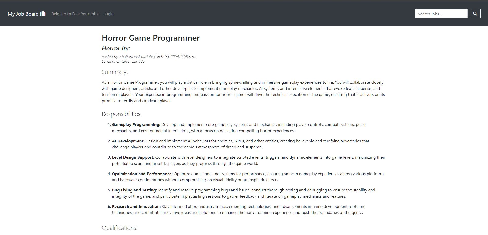

# CS50's Capstone Project "MyJobBoard"



## Introduction
This project uses django, JavaScript, HTML, and Boostrap to create a job board where users can post job ads, submit applications, and job posters can view resumes and cover letters.

## Distinctiveness and Complexity
This project is distinct from other projects in the course as it utilizes CKeditor to create rich text fields allowing job posters to create more creative and descriptive job postings. It allows deals with the uploading and viewing of PDF files. Additionally, boostrap is used to make sure the entire app works in mobile.

## Files Included
- Media Folder
    - A media folder will contain all cover letters and resumes uploaded by users submitting applications to job postings.
- Templates
    - the templates folder contains 8 html files all containing HTML and bootstrap that display the logic of each page.
- staitc
    - Holds CSS, JavaScript scripts, folders required regarding Ckeditor.
- models.py: Contains 3 models (User, JobListing, Application)
    - User: Uses Django's AbstractUser to allow for users who want to post jobs to create secure accounts.
    - JobListing: Holds relevant information regarding each job posting that will be displayed to job seekers when looking on the job board.
    - Application: Where job seekers will store information that is relevant for the job posters to review including email, resumes, and cover letters.
- forms.py: contains two classes regarding the logic for creating forms that will be used for creating Job listings and allowing users to upload their application.
- views.py: Hanldes most of the logic of the project including rendering html files, getting information and storing information into our models.
- admin.py: registered models so that they can be changed for testing during development.
- urls.py: holds all the urls that canbe used.

## How to Run:
    1. Install python3
    2. run the following commands:
    ```
    pip3 install Django
    pip3 install django-ckeditor
    python3 manage.py makemigrations jobportal
    python3 manage.py migrate
    python3 manage.py runserver
    ```

## Specification
- Boostrap is used in the entire app to ensure everything is looks nice and is mobile responsive.
- Richtext is used from Ckeditor to allow job posters to include things like bullet points or just make job listings look more polished.
- The ability to upload and view PDF's is present so job seeks can upload resume's and cover letters to job posters to view
- Authenticated job posters can create job listings or manage job lstings they can posted inluding:
    - viewing applications (name, resume, cover letter(if included), and email).
    - edit information about the listing.
    - Close listings so they are no longer visible to the public and will be gray on the job posters side indicated the application has been closed by them.
- When applications or job postings are posted succesfully a message will be displayed to the user that will then disappear after 3 seconds using JavaScript.
